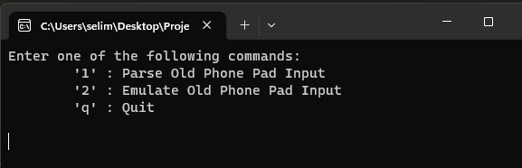

# Old Phone Challenge

Here is an old phone keypad with alphabetical letters, a backspace
key, and a send
button.
Each button has a number to identify it and pressing a button
multiple times will
cycle through the letters on it allowing each
button to represent more than one letter.
For example, pressing 2 once will return ‘A’ but pressing twice in
succession will return
‘B’.


<br>


## Features : OldPhonePadParser

The `OldPhonePadParser` class provides a set of tools to manipulate, validate, and parse old phone pad inputs.

### IsValidInput
```csharp
public static bool IsValidInput(string input)
```
Checks if a given string is a valid input. Valid inputs are strings that consist solely of numbers (0-9), spaces, *, and #.

#### Example
- IsValidInput("227*#") &#8594; true
- IsValidInput("4433555 555666#") &#8594; true
- IsValidInput("Nop") &#8594; false
- IsValidInput("44335a55 555666#") &#8594; false

---

### Simplify
```csharp
public static string Simplify(string input)
```
Cleans up the input string by removing hash (#) suffixes and simplifying white spaces.

#### Example
- Simplify("1#  654 654") &#8594; 1#
- Simplify("1   3") &#8594; 13
- Simplify("   44 33 555 0   555 666  #  55 ") &#8594; 44335550555666#

---

### OldPhonePad
```csharp
public static String OldPhonePad(string input)
```
Evaluates a given input string to determine its equivalent representation on an old-style phone pad. The function only allows numbers (0-9), spaces, *, and # as valid inputs.

#### Returns
The equivalent representation of the input on an old-style phone pad

#### Exceptions
- `System.ArgumentException`: Thrown if the input string contains invalid characters

#### Example
- OldPhonePad("33#") &#8594; E
- OldPhonePad("227*#") &#8594; B
- OldPhonePad("4433555 555666#") &#8594; HELLO
- OldPhonePad("8 88777444666*664#") &#8594; TURING

---

<br>

## Demo

There is a console application using the OldPhone library 

### We can parse an input :


### We can type as on an old keyboard :


<br>

## Notes

I designed my library to be easily extensible and maintainable, and to be easily exported and used elsewhere.  
I have tried to self-document my code as much as possible. However, I still document the exposed methods of my library with XML Documentation comments because it is really nice to have this kind of contextual informations (see below).  
In fact, with these comments and my tests, I was able to generate the documentation for this readme in just a few seconds.


